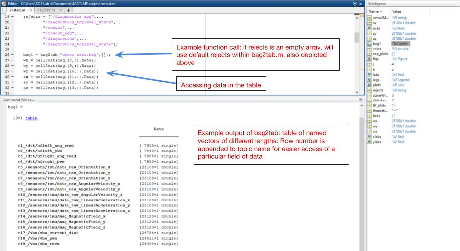

This is a function which I just started working on for analyzing data which is stored in ROS bags. bag2tab.m (ROS bag to Matlab table) is a Matlab function which scans a ROS bag file using standard Matlab tools, and converts available data into a organized table of named vectors of different dimensions in order to make the post processing of data easier. 
This function is meant to be readily expanded upon for all whom find the foundation useful. Soon there will be additional features to enhance error handling for more cases, in addition to another repository which features custom ROS features and message types, the first custom message types which will be introduced are the standard ROS messages but with time stamps. In order to use this function, one uses a string of the filename of the rosbag, and a string array of rejected topics which they do not wish to store in their table. For users to expand upon this further, they add an additional elseif statement with the desired message type following the current template. See bag2tab_test.m for an example implementation. 

